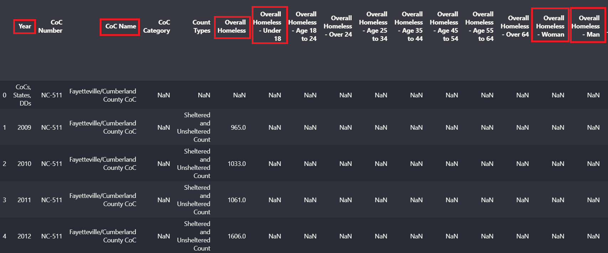

<h1 style="font-size: 400%; text-align:center;"> Community Impact Analysis-Bridging Data and Real-World Outcomes: Homeless Population in Fayetteville, NC </h1>

 Employee Retention 

 Written by Victor Chang | MBA 610 - Foundations of Data Analytics 

  

<h1 style="text-align:center;"> Executive Summary </h1>

This project investigates homelessness patterns and service accessibility in Cumberland County, North Carolina, through spatial analysis and historical data trends. With 383 individuals reported as experiencing homelessness in the 2025 Point-in-Time (PIT) count, the data reveals concentrated populations in downtown Fayetteville and underserved clusters to the west and south. Using both field observations and national data from the HUD Annual Homelessness Assessment Report, the project identifies geographic gaps in critical services such as shelters, warming centers, healthcare, and employment support. An interactive Streamlit map has been developed to visualize homeless concentrations in relation to existing resources. The findings point to a need for targeted interventions, such as mobile outreach units, expanded transit access, and strategically located resource hubs to bridge disparities and promote long term housing stability.

<h1 style="text-align:center;"> Introduction </h1>

Homelessness remains a persistent challenge in Cumberland County, NC, where systemic barriers such as lack of affordable housing, transportation, and mental health services contribute to housing insecurity. As of 2025, 383 individuals were counted as homeless in a 24-hour PIT survey, an increase from the prior year and a likely undercount due to the fluid nature of homelessness. Disproportionate impacts on black residents, individuals with chronic conditions, and victims of domestic violence reflect deeper structural inequities. This project aims to visualize where unsheltered populations are concentrated and assess how well existing services align with those needs. By combining field based observations with HUD data and GIS techniques, the analysis supports a data informed approach to resource planning and advocacy in Cumberland County.

<b style="font-size: 125%;"> Homeless People in Cumberland County </b>

As of 2025, Cumberland County, North Carolina, reported 383 individuals experiencing homelessness in its annual Point-in-Time (PIT) count, a slight increase from the previous year’s 380 (CityView NC, 2025). However, local officials caution that this number is likely an undercount due to the limitations of capturing homelessness over a single 24-hour period (CityView NC, 2025). Previous years provide insights into the homeless population’s composition. A 2021 PIT report showed that 72% of those experiencing homelessness were adults over the age of 24, with males comprising 57.3% and females 42.7% (Cumberland County Community Development, 2014). The report also noted a significant presence of individuals with chronic conditions, mental health issues, and victims of domestic violence (Cumberland County Community Development, 2014). Black and African American residents were disproportionately affected, making up over 40% of the homeless population despite representing only 17.8% of the general population (Cumberland County Community Development, 2014). Key contributing factors to homelessness in the county include lack of transportation, job instability, and eviction, all compounded by systemic issues such as the shortage of affordable housing and inadequate mental health and substance abuse services (Cumberland County Community Development, 2014).

<b style="font-size: 125%;"> Problem Definition </b>

The 2014 Plan to End Homelessness emphasizes that inadequate access to supportive housing, transportation, and job security exacerbates people’s inability to achieve stable living conditions, often leading to chronic unsheltered homelessness (Cumberland County Community Development, 2014). An effective solution for Cumberland County must integrate health care access, foster stable employment pathways, and elevate community understanding of homelessness, enabling interventions that address root vulnerabilities and promote long term housing stability.

<h1 style="text-align:center;"> Data Collection </h1>

<b style="font-size: 125%;"> Recording Observations </b>

<i> Purpose of Data </i>

This data was gathered during homeless missions hosted by church congregations. The numbers gathered point to the concentration of homeless populations in various areas of Cumberland County. Data was gathered visually and through conversations with homeless people, however it is not possible to be 100% sure of the accuracy of these numbers, since homeless people tend to move so frequently. The following data show areas of concentration where homeless communities tend to gather. This data is not all inclusive.

<h3 style="text-align:center;"> Homeless Concentrations in Cumberland County </h3>

| Name                | Address           | Latitude | Longitude | People | Category |
| ------------------- | ----------------- | -------- | --------- | ------ | -------- |
| Bus Station         | 505 Franklin St   | 35.0566  | -78.8795  | 80     | Homeless |
| Gillespie Zone      | 702 Gillespie St  | 35.0364  | -78.8802  | 25     | Homeless |
| Camp Maria          | 335 Ray Ave       | 35.0580  | -78.8843  | 15     | Homeless |
| Dollar Tree Raeford | 7715 S Raeford Rd | 35.0225  | -79.0267  | 10     | Homeless |
| B Street            | 519 Grove St      | 35.0588  | -78.8739  | 25     | Homeless |
| Public Library      | 300 Maiden Ln     | 35.0569  | -78.8809  | 80     | Homeless |

<b style="font-size: 125%;"> Online Data </b>

<i> Purpose of Data </i>

This data was gathered from the Annual Homelessness Assessment Report and should help identify the current trends over time for homeless populations in Cumberland County. The dates for the data do not account for the same information throughout all years and only a few of the columns are analyzed in this research project. The image below is a snapshot of the data gathered from the provided spreadsheets. The columns in red boxes are the only ones being analyzed in this project.

(HUD Exchange, 2024).

<h1 style="text-align:center;"> Analytical Techniques </h1>

<b style="font-size: 125%;"> Descriptive Statistics and Data Visualization </b>

The graph below shows lineplots of different home populations plotted against time, using the data gathered from the Annual Homelessness Assessment Report, 2024.

(HUD Exchange, 2024).

- Overall Homelessness has showed a sharp increase in 2011, followed by a sharp decrease in 2012. Since then, homeless numbers have been continuously decreasing over time until 2021, where there was another sharp increase.
- The under 18 homeless population also experienced a gradual decrease every year. Likewise, in 2021, numbers began increasing slightly and have continued to do so until now.
- The bottom two graphs contrast women vs men homeless population. While both have also showed a continuous decrease over time and similar patterns, homeless men seem to accout for a much higher percentage of the homeless population.

The link below redirects you to an application hosted on streamlit that allows for visual depiction of current homelessness concentration as well as proximities to resources in Cumberland County.

- Homeless Community Concentration and Resources
  [Launch the App](https://cumberlandcountyhomeless.streamlit.app/)

 

<h1 style="text-align:center;">Insights and Recommendations</h1>

<h3>Purpose:</h3>

Translate spatial data into actionable solutions that address gaps in homeless services across Cumberland County.

<i>Key Findings:</i>

<ul>
  <li><strong>High Concentration Areas:</strong> Homeless populations are most concentrated in downtown Fayetteville, with smaller but notable clusters west and south of downtown.</li>
  <li><strong>Shelter Distribution:</strong> Existing shelters are located near downtown, leaving western and southern populations without nearby overnight options.</li>
  <li><strong>Warming Centers:</strong> Warming centers are available downtown and north of the city, but none are located in the western or southern regions where unsheltered groups exist.</li>
  <li><strong>Healthcare Access:</strong> All mapped health centers are located north of downtown, limiting access for those in other regions.</li>
  <li><strong>Employment Services:</strong> Job assistance centers are clustered downtown, with limited access for populations residing farther out.</li>
  <li><strong>Libraries:</strong> Only two public libraries are shown, with one west of downtown and one downtown—potentially limiting access to internet, learning resources, and community support services.</li>
</ul>

<i>Service Gaps Identified:</i>

<ul>
  <li>Lack of shelters and warming centers in west and south Fayetteville</li>
  <li>No health clinics or mobile medical units in underserved areas</li>
  <li>Limited distribution of social support hubs like libraries and job centers</li>
</ul>

<i>Recommendations:</i>

<ul>
  <li><strong>Deploy Mobile Outreach Units:</strong> Deliver basic healthcare, hygiene kits, and social work support directly to underserved areas weekly or biweekly.</li>
  <li><strong>Establish Day Centers:</strong> Open daytime spaces for mental health counseling, shower/laundry access, storage lockers, and computer/internet access.</li>
  <li><strong>Expand Transit Access:</strong> Partner with city transit to offer free or subsidized bus passes tied to job training or shelter program participation.</li>
  <li><strong>Satellite Resource Hubs:</strong> Consider pop-up or rotating service centers (e.g., job assistance, benefits enrollment) in western and southern zones.</li>
  <li><strong>Community-Based Partnerships:</strong> Collaborate with churches, local businesses, and nonprofits to open warming stations and offer overnight shelter space during winter months.</li>
</ul>

<i>Next Steps:</i>

<ul>
  <li>Prioritize resource expansion based on spatial gaps identified in the map</li>
  <li>Engage local agencies for data validation and alignment with existing outreach efforts</li>
  <li>Use these insights to inform city funding proposals or collaborative grants</li>
  <li>Utilize a more comprehensive application that can be mutually beneficial to government agencies, NGOs, and the homeless population to stay informed of resources and resource allocation, and find ways to better serve the community</li>
</ul>

<h1 style="text-align:center;">Ethical Considerations</h1>

When conducting geospatial analysis on homelessness, ethical responsibility must guide all aspects of data collection, visualization, and interpretation. Mapping where individuals experiencing homelessness are located requires special care to avoid violating privacy or reinforcing social stigma. Publicly sharing precise locations could expose vulnerable populations to targeting, displacement, or surveillance. To mitigate this, data should be aggregated or generalized to protect identities while still supporting effective planning and outreach. Additionally, transparency about how data is collected and used is critical. The U.S. Department of Housing and Urban Development (HUD) emphasizes that data gathered through programs like the Homeless Management Information System (HMIS) must be handled with strict confidentiality and clear communication about its intended use (HUD Exchange, 2018). Finally, any digital tool or public report produced should empower service providers and community stakeholders, never criminalize or marginalize those the data represents. Ethical data practices are essential to ensure this project remains rooted in respect, safety, and human dignity.

<h1 style="text-align:center;">Conclusions</h1>

This analysis reveals significant disparities in the distribution of services for individuals experiencing homelessness in Cumberland County. While downtown Fayetteville houses many resources, key populations living west and south of downtown lack nearby access to shelters, healthcare, and warming centers. Visualizations and statistical trends highlight both the spatial mismatch of services and the growing need for responsive, equitable outreach. Recommendations emphasize deploying mobile services, increasing mental health and hygiene support, and creating collaborative infrastructure among local organizations. Ultimately, this project serves as a decision support tool that local agencies, nonprofits, and policy advocates can use to inform more just and effective homelessness interventions, rooted in both ethical integrity and community needs.

<h1 style="text-align:center;"> References </h1>

- CityView NC. (2025, June 18). Latest homeless population numbers in Cumberland County released, show a three-person increase. CityView NC. https://www.cityviewnc.com/stories/cumberland-county-homeless-population-totals-383-prelimary-pit-count-results-show
- Cumberland County Community Development. (2014). Plan to End Homelessness. Cumberland County, NC. https://www.co.cumberland.nc.us/docs/default-source/community-development-documents/end_homelessness_10-year_plan.pdf
- Cumberland County, NC (Cooling and Warming Centers)
  Cumberland County, North Carolina. (n.d.). Cooling & warming centers. Retrieved June 20, 2025, from https://www.cumberlandcountync.gov/emergencyservices/cooling-warming-centers
- Cumberland County, NC (White Flag Shelters)
  Cumberland County, North Carolina. (n.d.). White Flag shelters. Retrieved June 20, 2025, from https://www.cumberlandcountync.gov/emergencyservices/white-flag-shelters
- HUD Exchange (Annual Homelessness Assessment Report, 2024)
  U.S. Department of Housing and Urban Development. (2024). 2024 Annual Homelessness Assessment Report (AHAR). HUD Exchange. https://www.hudexchange.info/homelessness-assistance/ahar/#2024-reports
- HUD Exchange. (2018). Protecting data in an HMIS environment: Privacy, security, and confidentiality. U.S. Department of Housing and Urban Development. https://files.hudexchange.info/course-content/protecting-data-in-an-hmis-environment-privacy-security-and-confidentiality/Protecting-Data-in-an-HMIS-Environment-Privacy-Security-and-Confidentiality-Slides.pdf
- Tucker, C. (2021, March 25). Groups call for ethical guidelines on location-tracking tech. Wired. https://www.wired.com/story/groups-call-ethical-guidelines-location-tracking-tech/
