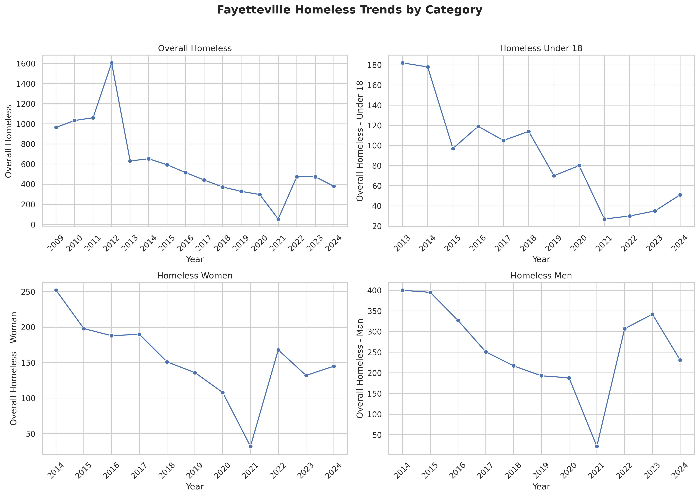

<h1 style="font-size: 400%; text-align:center;"> Community Impact Analysis-Bridging Data and Real-World Outcomes: Homeless Population in Fayetteville, NC </h1>

 Employee Retention 

 Written by Victor Chang | MBA 610 - Foundations of Data Analytics 

  

<h1 style="text-align:center;"> Executive Summary </h1>

<h1 style="text-align:center;"> Introduction </h1>

<b style="font-size: 125%;"> Homeless People in Cumberland County </b>

As of 2025, Cumberland County, North Carolina, reported 383 individuals experiencing homelessness in its annual Point-in-Time (PIT) count, a slight increase from the previous year’s 380 (CityView NC, 2025). However, local officials caution that this number is likely an undercount due to the limitations of capturing homelessness over a single 24-hour period (CityView NC, 2025). Previous years provide insights into the homeless population’s composition. A 2021 PIT report showed that 72% of those experiencing homelessness were adults over the age of 24, with males comprising 57.3% and females 42.7% (Cumberland County Community Development, 2014). The report also noted a significant presence of individuals with chronic conditions, mental health issues, and victims of domestic violence (Cumberland County Community Development, 2014). Black and African American residents were disproportionately affected, making up over 40% of the homeless population despite representing only 17.8% of the general population (Cumberland County Community Development, 2014). Key contributing factors to homelessness in the county include lack of transportation, job instability, and eviction, all compounded by systemic issues such as the shortage of affordable housing and inadequate mental health and substance abuse services (Cumberland County Community Development, 2014).

<b style="font-size: 125%;"> Problem Definition </b>

The 2014 Plan to End Homelessness emphasizes that inadequate access to supportive housing, transportation, and job security exacerbates people’s inability to achieve stable living conditions, often leading to chronic unsheltered homelessness (Cumberland County Community Development, 2014). An effective solution for Cumberland County must integrate health care access, foster stable employment pathways, and elevate community understanding of homelessness, enabling interventions that address root vulnerabilities and promote long term housing stability.

<h1 style="text-align:center;"> Data Collection </h1>

<b style="font-size: 125%;"> Recording Observations </b>

• Describe the areas in Fayetteville where homeless people are concentrated (as listed).
o Bus Station - 50
o Gillespie - 15
o Camp Maria - 10
o Walmart on 301 - 5
o B Street - 15
o Library – 50

<b style="font-size: 125%;"> Online Data </b>

<i> Purpose of Data </i>

Identify service deserts
Inform placement of new service centers
Support funding decisions and policy advocacy
Improve coordination between agencies

<h1 style="text-align:center;"> Analytical Techniques </h1>

<b style="font-size: 125%;"> Descriptive Statistics </b>

• Calculate frequencies (e.g., how many people were observed at each location).
• Compare local findings to national/state averages.
• Look at age/gender distribution if available.

<b style="font-size: 125%;"> Data Visualization </b>

• Homeless Community Concentration and Resources
👉 [Launch the App](https://cumberlandcountyhomeless.streamlit.app/)

 

<h1 style="text-align:center;"> Insights and Recommendations </h1>

Purpose: Translate data into solutions.
• What did your data show about concentration, needs, and underserved areas?
• What programs are lacking in Fayetteville based on your findings?
• Propose solutions like:
o More housing-first programs
o Day centers for mental health and hygiene
o Bus passes/job training partnerships
o Mobile outreach for healthcare and social services

<b style="font-size: 125%;"> Ethical Considerations </b>

<b style="font-size: 125%;"> Conclusion </b>

<h1 style="text-align:center;"> References </h1>

- CityView NC. (2025, June 18). Latest homeless population numbers in Cumberland County released, show a three-person increase. CityView NC. https://www.cityviewnc.com/stories/cumberland-county-homeless-population-totals-383-prelimary-pit-count-results-show
- Cumberland County Community Development. (2014). Plan to End Homelessness. Cumberland County, NC. https://www.co.cumberland.nc.us/docs/default-source/community-development-documents/end_homelessness_10-year_plan.pdf
- Cumberland County, NC (Cooling and Warming Centers)
  Cumberland County, North Carolina. (n.d.). Cooling & warming centers. Retrieved June 20, 2025, from https://www.cumberlandcountync.gov/emergencyservices/cooling-warming-centers
- Cumberland County, NC (White Flag Shelters)
  Cumberland County, North Carolina. (n.d.). White Flag shelters. Retrieved June 20, 2025, from https://www.cumberlandcountync.gov/emergencyservices/white-flag-shelters
- HUD Exchange (Annual Homelessness Assessment Report, 2024)
  U.S. Department of Housing and Urban Development. (2024). 2024 Annual Homelessness Assessment Report (AHAR). HUD Exchange. https://www.hudexchange.info/homelessness-assistance/ahar/#2024-reports
